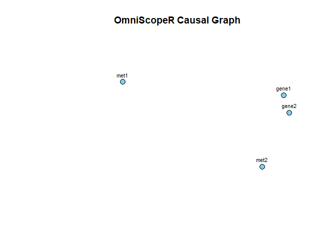

<!-- README.md is generated from README.Rmd. Please edit that file -->

# OmniScopeR

<!-- badges: start -->

<!-- badges: end -->

# OmniScopeR

**OmniScopeR** — a causality-aware visualization framework for
multi-omics integration and exploration.

``` r
library(OmniScopeR)

# Example data
df1 <- data.frame(gene1 = rnorm(10), gene2 = rnorm(10))
df2 <- data.frame(met1 = rnorm(10), met2 = rnorm(10))
rownames(df1) <- rownames(df2) <- paste0("Sample", 1:10)

omics <- omni_integrate(df1, df2)
graph <- omni_causal(omics)
omni_visualize(graph)
```



``` r
importance <- omni_explain(omics, phenotype = rnorm(10))
omni_narrate(omics, graph, importance)
#> OmniScopeR Report
#> =================
#> Samples: 10
#> Features: 4
#> 
#> Top Important Features:
#> gene2, gene1, met2, met1
#> 
#> Causal Graph Density: 0
```
